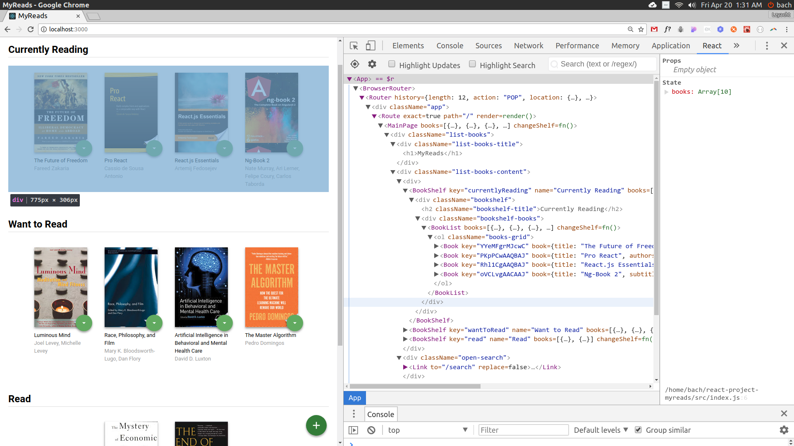
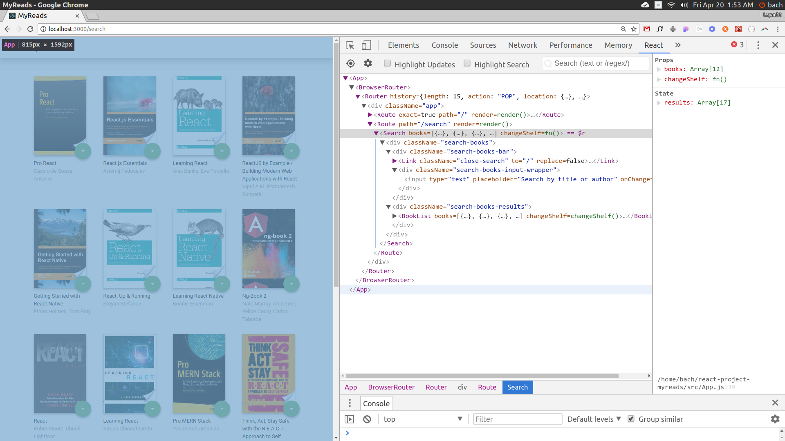

# MyReads Project

This is a project for demonstrate understanding of the basic structure and operation of a React-based app.

## Insatll

Install all dependencies to run the project

```bash
git clone https://github.com/lzyacht/react-myreads.git
npm install
```

Use following command to start

```bash
npm start
```

## How to Use the App

* Books are sorted into three categories: Currently Reading, Want to Read and Read
* There is a main page to show all those three categories



* To add new books, click on the green + button at the bottom of the page.
Enter an author's name or subject. Up to 20 items will be returned.

*Note: The backend API is limited to a fixed set of [search terms](#search-terms)  -- see below for valid search options*



## Search Terms
'Android', 'Art', 'Artificial Intelligence', 'Astronomy', 'Austen', 'Baseball', 'Basketball', 'Bhagat', 'Biography', 'Brief', 'Business', 'Camus', 'Cervantes', 'Christie', 'Classics', 'Comics', 'Cook', 'Cricket', 'Cycling', 'Desai', 'Design', 'Development', 'Digital Marketing', 'Drama', 'Drawing', 'Dumas', 'Education', 'Everything', 'Fantasy', 'Film', 'Finance', 'First', 'Fitness', 'Football', 'Future', 'Games', 'Gandhi', 'History', 'History', 'Homer', 'Horror', 'Hugo', 'Ibsen', 'Journey', 'Kafka', 'King', 'Lahiri', 'Larsson', 'Learn', 'Literary Fiction', 'Make', 'Manage', 'Marquez', 'Money', 'Mystery', 'Negotiate', 'Painting', 'Philosophy', 'Photography', 'Poetry', 'Production', 'Program Javascript', 'Programming', 'React', 'Redux', 'River', 'Robotics', 'Rowling', 'Satire', 'Science Fiction', 'Shakespeare', 'Singh', 'Swimming', 'Tale', 'Thrun', 'Time', 'Tolstoy', 'Travel', 'Ultimate', 'Virtual Reality', 'Web Development', 'iOS'

*This project is licensed under the terms of the MIT license.*
